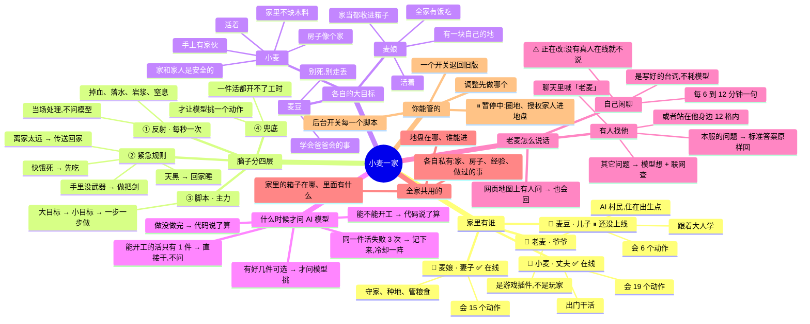
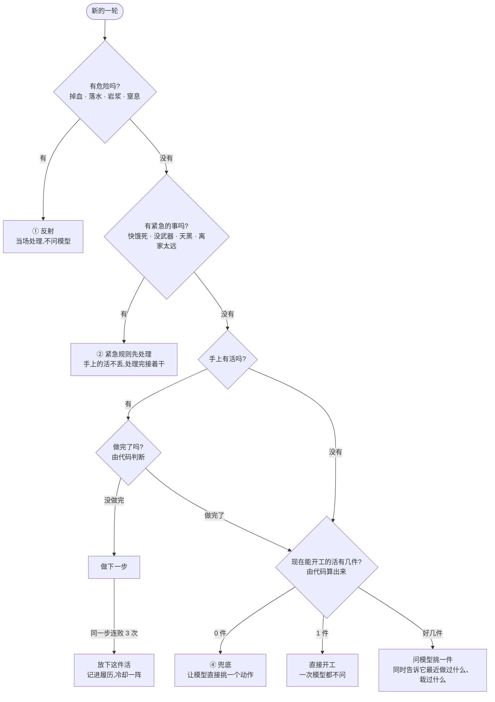

# 小麦一家是怎么运转的

> 一张图看懂这个服务器上的 AI 家庭:谁是谁、各自想干什么、什么时候才动用 AI 模型。
> 数据是 **2026-09-18 从线上实际运行的配置里读出来的**,不是凭文档画的(见文末「这张图的依据」)。

## 全家总览



## AI 玩家每一轮是怎么决定干什么的

小麦、麦娘、麦豆三个跑的是**同一份代码**,只是职业不同,所以决策流程一模一样。



**这个设计最重要的一条:凡是代码能确定的事,就不问模型。**
模型只做它擅长的一件事 —— 在几个都能做的选项里挑一个。
它不可能挑出做不到的事,因为做不到的根本不会出现在候选名单里。

## 每个人具体会做哪些事

| 大目标 | 小麦 👨 | 麦娘 👩 | 麦豆 👦 |
|---|---|---|---|
| **活着** | 交给反射和紧急规则 | 交给反射和紧急规则 | 天黑或受伤就回家 |
| **家和家人安全** | 天黑回家睡觉 · 赶走家门口的怪 · ⏸圈地 · ⏸授权家人 | | |
| **房子像个家** | 造工作台和箱子 · 凑盖房材料 · 从箱子取材料 · 把房子盖完 | | |
| **手上有家伙** | 做一把剑 | | |
| **家里不缺木料** | 砍树 · 把木料存进箱子 · 出去找林子 | | |
| **全家有饭吃** | | 收割熟了的庄稼 · 把小麦做成面包 · 粮食存进粮箱 · 做粮箱 | |
| **有块自己的地** | | 做锄头 · 耕地 · 从箱子拿种子 · 割草弄种子 · 播种 | |
| **家当收进箱子** | | 把家当收进箱子 · 原木做成木板 | |
| **学会爸爸会的事** | | | 在家附近玩 · 跟爸爸去看砍树 |

⏸ = 暂停中(Owner 2026-09-18 决定「暂时先别圈」)。全部 28 个脚本,开着 26 个。

---

## 这张图的依据

画之前对照了线上实际运行的东西,而不是只看说明文档 —— 说明文档里已经有两处过时了:

| 项目 | 说明文档(server/11) | 线上实际 |
|---|---|---|
| 小麦会几个动作 | 18 | **19** |
| 麦娘会几个动作 | 9 | **15**(昨晚新学了种地那一套) |
| 麦豆 | 列在表里 | **已设计、没在运行**(线上只有小麦和麦娘两个进程) |

- 家庭关系、人格、动作清单 ← `roles.json`
- 大目标、脚本、开关状态 ← `scripts.json`
- 谁在运行 ← 服务器上实际的进程
- 老麦的规则 ← 老麦插件的配置(触发方式、12 格范围、闲聊间隔)

### 关于老麦的闲聊(2026-09-18 查的)

Owner 觉得「没真人的时候老麦还在说话,浪费算力」。查下来:

```
老麦说的 164 句里
├ 写好的闲聊台词(不调用模型)   163 句   其中对着空服务器说的 56 句
└ 模型现场想出来的回答           1 句
```

**闲聊几乎不耗算力** —— 那些是预先写好的句子。但它确实该关:
台词里「点名某个在线玩家」的功能会把机器人也当成玩家,
于是没真人的时候,它一直在对小麦和麦娘说「MaiNiang 你好」「你的房子圈领地了没」。
**正在改成:没有真人在线就不闲聊,点名也只点真人。** 有人找它说话(包括从网页上问)照常回答。

> 数这个数的时候,第一版把「午夜前就在线的人」漏掉了 ——
> 今天的日志从午夜才开始,那几行「上线」记在昨天的日志里。
> 跨午夜把两天日志接起来,才是上面这个数。
> (同一类错误见 [docs/26](../docs/26-that-was-not-a-control-group.md))

**架构细节**见 [server/11 · AI 玩家的脑子是怎么运转的](../server/11-ai-player-brain.md);
**每一条设计为什么这么定**见 [server/12 · 怎么驱动 AI 玩家](../server/12-driving-ai-players.md)。
